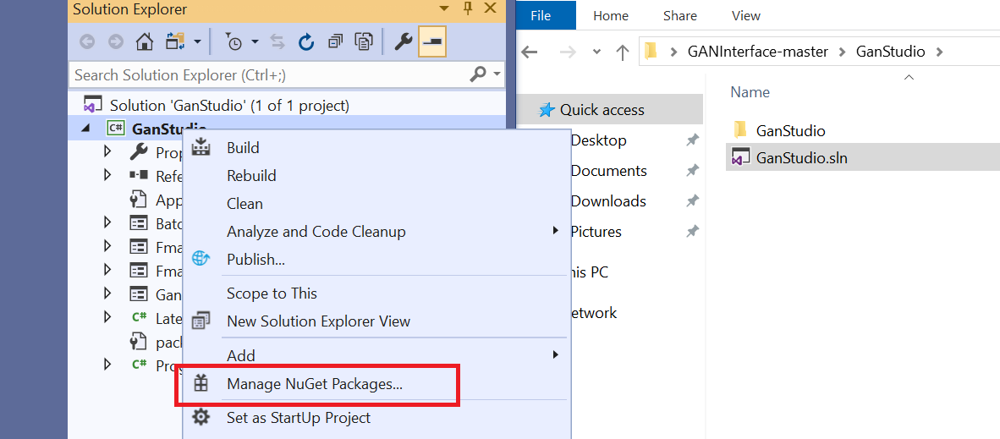
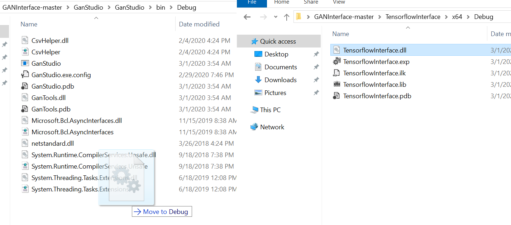
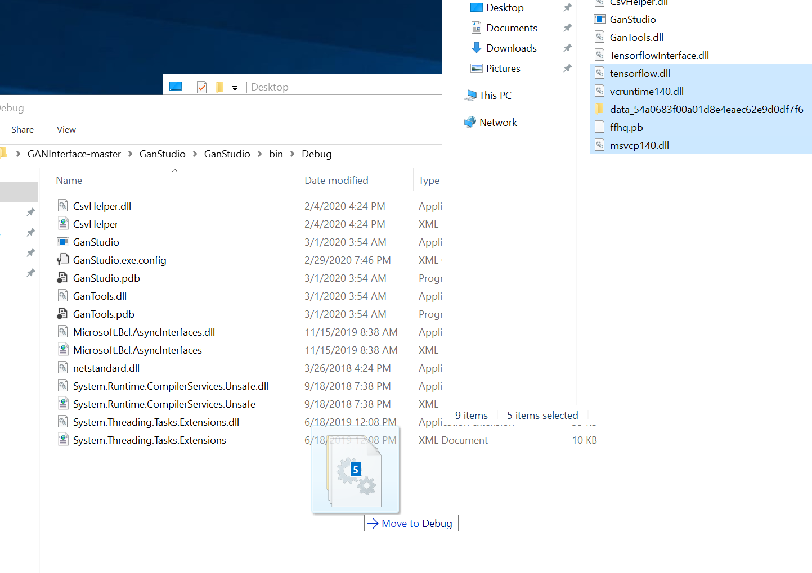

Blogs:
Introduction:
https://towardsdatascience.com/animating-ganime-with-stylegan-part-1-4cf764578e
Tutorial + link to compiled version
https://towardsdatascience.com/animating-ganime-with-stylegan-the-tool-c5a2c31379d

Important note: I would not recommend trying to build this yourself yet, I need to include better instructions and I'd like to get it working with models trained on the official StyleGAN implementation instead of just my personal one (https://github.com/nolan-dev/stylegan_reimplementation).  I'm planning on providing these updates in the next week or so.

This is a tool for interacting with images generated by a StyleGAN model.

It has 3 parts:
- TensorflowInterface: Native DLL that uses the TensorFlow C API and tensorflow.dll to interact with a frozen model
- GanTools: .NET DLL that interacts with with TensorflowInterface DLL, which can be imported into a game or GanStudio
- GanStudio: .NET EXE test harness that interacts with the GanTools DLL.

The GanStudio tool includes features such as batch generation, truncation trick slider, feature map viewing/sorting, feature map modification, saving/importing images, customizable latent vector modification, image interpolation, and animation through incremental modification of feature maps or latent values. 

All these features were added on a ad hoc basis and optimized for implementation speed, which has resulted in extremely messy UI/code unfortunately:

 
 

However, I think there is value in quickly creating interactive tools like this, I believe they can help give insight where approaches that allow slower interaction (such as running cells in a jupyter notebook) don't.  Evidence for this is pending some experimental results.

Images from a model trained on an anime dataset https://www.gwern.net/Danbooru2018

Compilation instructions (tested on AWS Windows Server 2019 instance):

1. Install Visual Studio (tested with Community 2019) with ".NET desktop developement" and "Desktop developement with C++"

2. Open TensorflowInterface.sln in visual studio, right click the project, and build

3. Open GanTools.sln in visual studio, right click the project, and select "Manage NuGet Packages" (below pictured for GanStudio)

4. Click 'Restore' in the top bar that says 'Some NuGet packages are missing from this solution'

5. Right click the project and click build

6. Repeat 3-5 for GanStudio.sln

7. Copy TensorflowInterface.dll to the bin directory for GanStudio

8. Copy dependencies tensorflow.dll, vcruntime140.dll, msvcp140.dll, and the graph/data files to the bin directory.  These should be available in a recent .zip in https://github.com/nolan-dev/GANInterface/releases

9. Run GanStudio.exe